# NeuroSim 2.0 — 14-Layer Target Architecture & System Blueprint

## 1. Executive Summary & Layered Architecture Overview
NeuroSim 2.0 is structured around a strict 14-layer decoupled architecture. Business logic, mathematical signal processing, and data acquisition are completely decoupled from UI widgets and presentation components.

```mermaid
graph TD
    L1[1. Presentation Layer - PySide6 UI Screens] --> L2[2. Application State Layer - CentralStateManager]
    L2 --> L3[3. Acquisition Layer - AcquisitionManager]
    L3 --> L4[4. Signal Contract Layer - SignalFrame]
    L3 --> L14[14. Hardware Abstraction Layer - Transport Adapters]
    L4 --> L5[5. Signal Buffer Layer - BoundedSignalBuffer]
    L5 --> L6[6. Signal Quality Layer - SignalQualityEvaluator]
    L5 --> L7[7. Signal Processing Layer - PSD & Filtering]
    L7 --> L8[8. Quantitative EEG Layer - Feature Extractor]
    L8 --> L9[9. Cognitive Analysis Layer - Rule & ML Classifiers]
    L5 --> L10[10. Session Layer - SessionManager]
    L10 --> L11[11. Database Layer - DatabaseManager]
    L10 --> L12[12. Reporting Layer - PDFReportGenerator]
    L2 --- L13[13. Configuration Layer - AppConfig]
```



---

## 2. Layer-by-Layer Specifications

### Layer 1: Presentation Layer (`src/ui/`)
- **Responsibilities**: PySide6 desktop views, custom widgets, real-time scrolling plots, and layout management.
- **Boundaries**: Strictly reactive. Reads data via Qt signals from `CentralStateManager` and `AcquisitionManager`. Performs zero mathematical DSP or state mutations directly in UI widget event handlers.
- **Key Modules**: `main_window.py`, `screens/*.py`, `visualization/*.py`.

### Layer 2: Application State Layer (`src/app/state.py`)
- **Responsibilities**: Centralized state machine managing connection state (`IDLE`, `SCANNING`, `CONNECTING`, `CONNECTED`, `STREAMING`, `PAUSED`, `DISCONNECTING`, `ERROR`), active input source (`NONE`, `SIMULATOR`, `ESP32_USB`, `ESP32_WIFI`), and session state.
- **Boundaries**: Thread-safe Qt controller. Rejects illegal state transitions deterministically.
- **Key Modules**: `CentralStateManager`, `ConnectionState`, `InputSource`, `ConnectionTelemetry`.

### Layer 3: Acquisition Layer (`src/acquisition/acquisition_manager.py`)
- **Responsibilities**: Ingestion manager registering and selecting generic `SignalSource` objects or transport adapters.
- **Boundaries**: Decouples UI screens from raw thread workers. Delivers normalized frames into the `BoundedSignalBuffer`.
- **Key Modules**: `AcquisitionManager`.

### Layer 4: Signal Contract Layer (`src/acquisition/contracts.py`)
- **Responsibilities**: Canonical dataclass contracts (`SignalFrame` / `NormalizedFrame`) and generic `BaseSignalSource` / `BaseConnectionAdapter` abstract interfaces.
- **Boundaries**: Generic payload definition (`timestamp`, `sequence`, `sampling_rate`, `channel_count`, `channels`, `data`, `source`, `metadata`, `latency_ms`, `integrity_status`). Enforces strict field validation upon instantiation.
- **Key Modules**: `SignalFrame`, `BaseSignalSource`, `BaseConnectionAdapter`.

### Layer 5: Signal Buffer Layer (`src/processing/signal_buffer.py`)
- **Responsibilities**: Thread-safe bounded rolling ring buffer (`BoundedSignalBuffer` / `SignalBuffer`).
- **Boundaries**: Fixed capacity (1250 samples @ 250 Hz = 5 seconds rolling window). FIFO eviction when capacity is reached. Preserves sample values, timestamps, and sequence numbers.
- **Key Modules**: `BoundedSignalBuffer`.

### Layer 6: Signal Quality Layer (`src/quality/signal_quality.py`)
- **Responsibilities**: Real-time evaluation of signal integrity, missing samples, clipping, noise level, and sequence continuity.
- **Boundaries**: Computes quality state (`NO_SIGNAL`, `INSUFFICIENT_DATA`, `POOR`, `FAIR`, `GOOD`, `EXCELLENT`).
- **Key Modules**: `SignalQualityEvaluator`.

### Layer 7: Signal Processing Layer (`src/processing/`)
- **Responsibilities**: Digital filtering and spectral transformation algorithms.
- **Boundaries**: Pure mathematical transformations. Receives raw time-series numpy arrays and returns filtered arrays and Welch PSD power spectra.
- **Key Modules**: `filter.py` (`EEGFilter`), `psd.py` (`PSDAnalyzer`).

### Layer 8: Quantitative EEG Layer (`src/features/extractor.py`)
- **Responsibilities**: Feature extraction computing Absolute Band Power (ABP), Relative Band Power (RBP), Theta/Beta Ratio (TBR), Alpha/Beta Ratio (ABR), and Engagement Index (EI).
- **Boundaries**: Converts raw PSD arrays into structured quantitative metrics vectors.
- **Key Modules**: `FeatureExtractor`.

### Layer 9: Cognitive Analysis Layer (`src/classification/`)
- **Responsibilities**: Classification of cognitive workload states (`LOW`, `OPTIMAL`, `HIGH`, `EXTREME`).
- **Boundaries**: Consumes quantitative EEG feature vectors. Executes Rule-Based heuristics and ML Random Forest predictions.
- **Key Modules**: `rule_classifier.py` (`RuleBasedClassifier`), `ml_classifier.py` (`MLClassifier`).

### Layer 10: Session Layer (`src/session/session_manager.py`)
- **Responsibilities**: Management of session lifecycle (`IDLE`, `RECORDING`, `PAUSED`, `COMPLETED`).
- **Boundaries**: Handles start/pause/stop recording triggers and attaches event markers.
- **Key Modules**: `SessionManager`.

### Layer 11: Database Layer (`src/database/db_manager.py`)
- **Responsibilities**: Persistent storage of completed sessions, time-stamped metrics, and session events into SQLite database (`neurosim_history.db`).
- **Boundaries**: Encapsulates all SQL CRUD operations.
- **Key Modules**: `DatabaseManager`.

### Layer 12: Reporting Layer (`src/reporting/pdf_generator.py`)
- **Responsibilities**: Production of quantitative executive PDF reports using ReportLab.
- **Boundaries**: Consumes session objects and metrics history to compile PDF documents.
- **Key Modules**: `PDFReportGenerator`.

### Layer 13: Configuration Layer (`src/app/config.py`)
- **Responsibilities**: Centralized system settings (sampling rate = 250 Hz, band frequency limits, filter cutoffs, UI refresh rates).
- **Boundaries**: Authoritative source of configuration constants.
- **Key Modules**: `config.py`.

### Layer 14: Hardware Abstraction Layer (`src/acquisition/adapters.py`)
- **Responsibilities**: Low-level transport adapters (`ESP32SerialAdapter`, `ESP32WifiAdapter`, `SimulatorAdapter`).
- **Boundaries**: Translates raw hardware/network bytes into standardized `SignalFrame` objects.
- **Key Modules**: `adapters.py`.

---

## 3. Data Flow Architecture
```
[Transport / Generator]
         │ (raw bytes/waveform)
         ▼
[SignalFrame Contract]
         │ (validated payload)
         ▼
[BoundedSignalBuffer (1250 samples @ 250 Hz)]
         │
         ├───> [Signal Quality Subsystem] ───> Quality Score
         │
         ├───> [Butterworth Bandpass SOS Filter (0.5 - 30 Hz)]
         │           │
         │           ▼
         │     [Welch PSD Engine (Hanning, N=256)]
         │           │
         │           ▼
         │     [Quantitative EEG Feature Extractor]
         │           │
         │           ├───> [Rule-Based Heuristic Classifier] ───> Cognitive Load State
         │           └───> [Random Forest ML Classifier]  ───> Workload Prediction
         │
         └───> [PySide6 Live Monitor Views & Qt Signal Dispatcher]
```

---

## 4. Protected Scientific Files (STRICT REGRESSION BOUNDARY)
The following core algorithms are validated baseline modules and MUST NOT be modified without explicit authorization:
- `src/processing/psd.py` (Welch FFT & spectral integration)
- `src/processing/filter.py` (Butterworth bandpass & notch filter)
- `src/classification/rule_classifier.py` (Rule-based heuristics)
- `src/classification/ml_classifier.py` (Random Forest classifier)
- `src/reporting/pdf_generator.py` (ReportLab PDF exporter)
- `firmware/esp32/neurosim_esp32.ino` (ESP32 firmware)
